<h2>Hi there, I am Ali Hassan.</h2>

  

  

<h3><code>alihassan-9 ~ $ ./contributions.sh</code></h3>

  

<h3><code>alihassan-9 ~ $ whoami</code></h3>
<table>
  <tr>
    <td valign="top"></td>
    <td valign="top">
      <table width="330">
        <tr><td colspan="2">🔴&nbsp;🟡&nbsp;🟢</td></tr>
        <tr><td colspan="2"><small><code>alihassan-9 ~ %</code></small></td></tr>
        <tr><td colspan="2">
</td></tr>
        <tr><td><small><b>Now</b></small></td><td><small>Fresher AI/ML Engineer, open to roles</small></td></tr>
        <tr><td><small><b>Prev</b></small></td><td><small>AI Contractor, Turing</small></td></tr>
        <tr><td><small><b>Projects</b></small></td><td><small>Axiom AI, Atlas, One Mix AI, AI Shopping Advisor</small></td></tr>
        <tr><td><small><b>Stack</b></small></td><td><small>Python, LangChain, LangGraph, FastAPI, Next.js</small></td></tr>
        <tr><td><small><b>Education</b></small></td><td><small>BS AI, UCP Lahore</small></td></tr>
        <tr><td><small><b>Location</b></small></td><td><small>Lahore, Pakistan · Remote, 30+ hrs/wk</small></td></tr>
      </table>
    </td>
  </tr>
</table>

 

### 🚀 About Me

AI Engineer specializing in LLMs, Multi-Agent Systems, and RAG pipelines, with over a year of hands-on experience building production-ready intelligent systems using LangChain, LangGraph, Google ADK, and the Model Context Protocol (MCP). Recent AI graduate (BS Artificial Intelligence, University of Central Punjab) who scored in the 97.7th percentile on Pakistan's HEC National Skill Competency Test. Most recently worked as an AI Contractor at Turing, evaluating LLM and agentic workflow outputs against structured quality rubrics.

### 💡 Core Strengths

- 🤖 AI & Agentic System Development: multi-agent architectures, RAG pipelines, context engineering
- 🌐 Full-Stack Engineering: FastAPI and Flask backends paired with Next.js and React frontends
- 👁️ Computer Vision & AI Evaluation: YOLOv8, structured side-by-side evaluation, fact-checking of model outputs
- 🎯 Applied Generative AI: prompt engineering and deployment of real-world AI solutions across finance, retail, and generative UI domains

### 🏆 Highlights

- 🧾 Built Axiom AI, a 5-agent neuro-symbolic RAG pipeline (Google ADK) that audits vendor invoices end to end, with a 9 of 10 offline evaluation pass rate
- 🕸️ Designing Atlas, a production-grade multi-agent system with persistent memory, MCP-based tool integrations, and an evaluation harness
- 🎨 Shipped One Mix AI, which generates a complete UI from a text prompt or hand-drawn sketch in 30 to 60 seconds
- 🛒 Built a 4-agent LangGraph shopping advisor, tested across 50+ products, achieving 80 to 85% recommendation accuracy
- 🚗 Trained and evaluated a YOLOv8 model for automotive defect detection on a 100+ image annotated dataset

### 📫 Let's Connect

Open to fresher AI/ML Engineer and AI Agent Developer roles, remote-friendly and comfortable with 30+ hour weekly commitments. Reach out via the links above.
