<h3><code>ali@github ~ $ ./contributions.sh</code></h3>

  

<h3><code>ali@github ~ $ whoami</code></h3>
<table>

  

  

 

 

  

<h3><code>ali@github ~ $ ./contributions.sh</code></h3>

  

<h3><code>ali@github ~ $ whoami</code></h3>
<table>
  <tr>
    <td valign="top"></td>
    <td valign="top"></td>
  </tr>
</table>

 

### 🚀 About Me

AI Engineer specializing in **LLMs, Multi-Agent Systems, and RAG pipelines**, with over a year of hands-on experience building production-ready intelligent systems using LangChain, LangGraph, Google ADK, and the Model Context Protocol (MCP). Recent AI graduate (BS Artificial Intelligence, University of Central Punjab) who scored in the 97.7th percentile on Pakistan's HEC National Skill Competency Test. Most recently worked as an AI Contractor at **Turing**, evaluating LLM and agentic-workflow outputs against structured quality rubrics.

### 🧩 Tech Stack & Specializations

- 🤖 **AI & Agentic Systems:** Multi-Agent Systems · LangChain · LangGraph · Google ADK · MCP · RAG Pipelines · Prompt Engineering · Context Engineering
- 🧠 **ML & Deep Learning:** PyTorch · CNNs · YOLOv8 · Computer Vision · NLP · Transformers · Hugging Face
- ⚙️ **Backend & APIs:** FastAPI · Flask · REST APIs
- 🎨 **Frontend:** Next.js · React · Tailwind CSS
- 🗄️ **Databases & Vector Stores:** PostgreSQL · Supabase · FAISS · ChromaDB · SQLite
- 🚢 **DevOps & Cloud:** Docker · GitHub Actions · Vercel

### 🏆 Highlights

- Built **Axiom AI** — a 5-agent neuro-symbolic RAG pipeline (Google ADK) that audits vendor invoices end to end, with a 9/10 offline evaluation pass rate
- Designing **Atlas** — a production-grade multi-agent system with persistent memory, MCP-based tool integrations, and an in-progress evaluation harness
- Shipped **One Mix AI** — generates a complete UI from a text prompt or hand-drawn sketch in 30–60 seconds
- Built a 4-agent LangGraph shopping advisor, tested across 50+ products, achieving 80–85% recommendation accuracy
- Trained and evaluated a YOLOv8 model for automotive defect detection on a 100+ image annotated dataset

### 📫 Let's Connect

Open to fresher AI/ML Engineer and AI Agent Developer roles — remote-friendly, comfortable with 30+ hour weekly commitments. Reach out via the links above.
  <tr>
    <td valign="top"></td>
    <td valign="top"></td>
  </tr>
</table>

